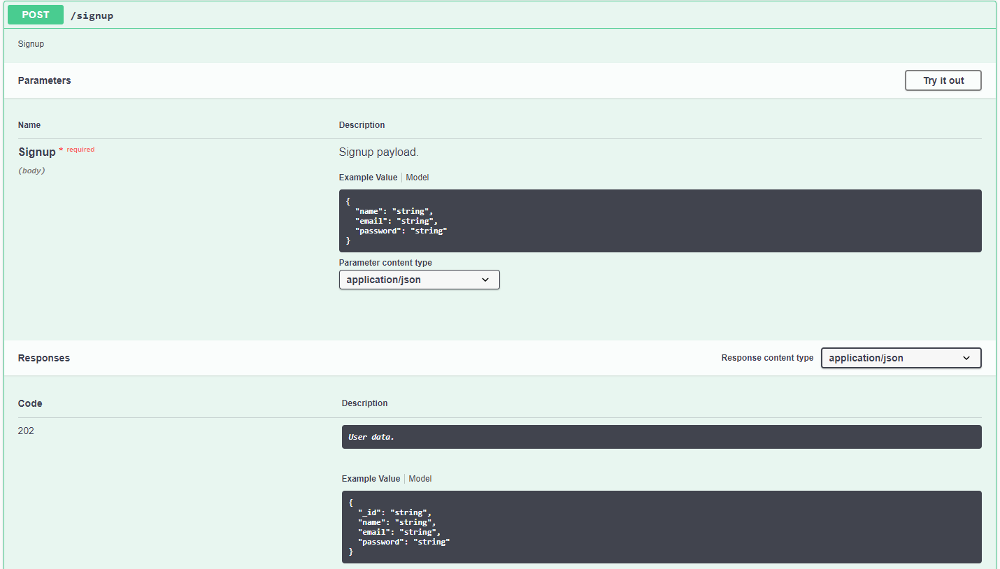
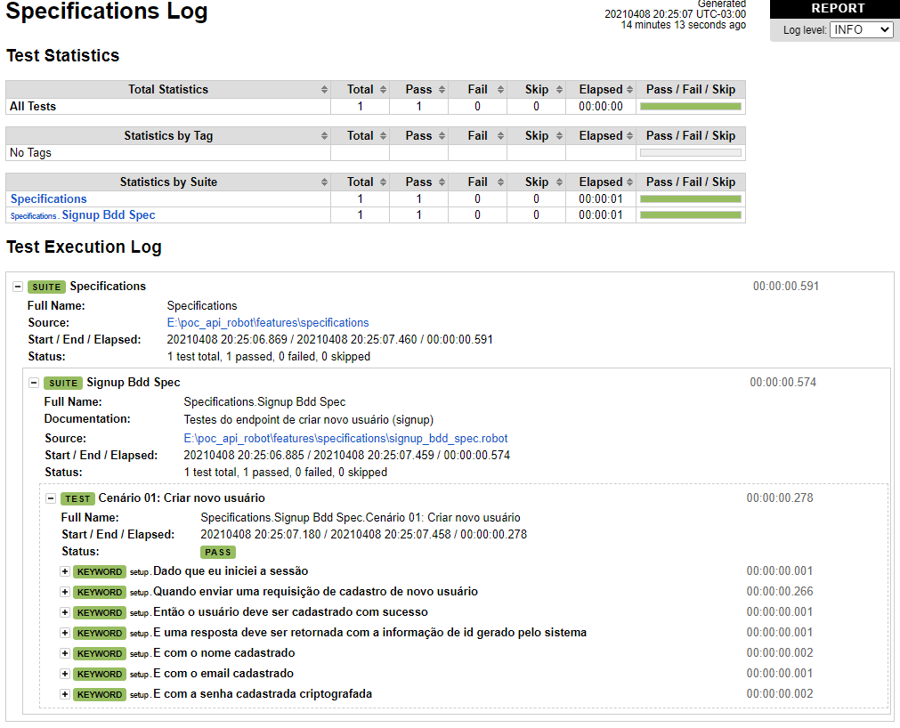

# Robot Framework para testes de API

Projeto para apresentar a ferramenta Robot Framework para testes de API.

## Robot Framework

É um framework de automação open source usado para automação de testes e RPA (Robotic Process Automation).
É implementado em Python, podendo ser executado em Jython (JVM) e IronPython (.NET), ele também permite a adição de bibliotecas (Libraries) de acordo com as necessidades do projeto.
O Robot framework atua como um gerenciador de testes automatizados, já as "Libraries" fornecem os recursos reais de automação e teste para o framework, a partir das palavras-chave (Keywords). Dessa forma, os casos de testes são escritos no formato tabular, utilizando-se dessas keywords.

## Alvo do teste

A  API alvo dos testes é a [18.189.43.194:3333/api-docs](http://18.189.43.194:3333/api-docs/), no endpoint /signup para o caminho feliz para a criação de um usuário com sucesso.



## Pré requisitos

Configuração de ambiente:
- Python:
  Instalar e configurar variável de ambiente

Libraries:
- [Robot framework](https://robotframework.org/#learning)

  ~~~~
  pip install robotframework
  ~~~~

<!-- - [Requests](https://docs.python-requests.org/en/master/)

  ~~~~
  pip install requests
  ~~~~ -->

- [Robotframework-requests](https://github.com/MarketSquare/robotframework-requests#readme)
  
  ~~~~
  pip install robotframework-requests
  ~~~~

<!-- - [Robotframework-jsonlibrary](https://github.com/robotframework-thailand/robotframework-jsonlibrary)

  ~~~~
  pip install -U robotframework-jsonlibrary
  ~~~~

- [Robotframework-restinstance](https://github.com/asyrjasalo/RESTinstance/)

  ~~~~
  pip install --upgrade RESTinstance
  ~~~~ -->

- [Robotframework-faker](https://pypi.org/project/robotframework-faker/)

  ~~~~
  pip install robotframework-faker
  ~~~~
## Testes
Para executar os testes de api utilize o seguinte comando:

  ~~~~
  robot --loglevel DEBUG:INFO -d ./logs features/specifications/
  ~~~~
### Organização dos testes
  
    ├── docker                    # Diretório de arquivos do docker  
    ├── features                  # Pastas e arquivos do framework (root)  
      ├── logs                    # Diretório para armazenar o relatório de execução dos testes  
      ├── resources               # Diretório para os arquivos helpers, como variáveis, métodos auxiliares e configurações.  
        ├── fixtures              # Diretório de dados default.  
      ├── steps_definitios        # Passo-a-passo dos testes BDD (auxiliar da pasta specifications)  
      ├── specifications          # Suíte de testes com as suas especificações em BDD  
    ├── .gitignore                # Files and Folders to ignore in repository.  
    └── README.md                 # Documentação do projeto  

### Testes usando o BDD

Os cenários são escritos de forma ubíqua utilizando das Keywords.
O conjunto de Keywords do arquivo signup_bdd_steps.robot é responsável por dizer o que cada frase do cenário signup_bdd_spec.robot irá executar. Já o arquivo signup_bdd_steps_definitions é responsável por definir cada ação que as frases do cenário irão executar (mais baixo nível).
Dessa forma, a ordem de hierarquia entre os arquivos é: 
````
signup_bdd_spec.robot -> signup_bdd_steps.robot -> signup_bdd_steps_definitions.robot
````

### Relatório de execução

O Robotframework por padrão já gera um relatório de execução da suíte de testes, informando com precisão o que foi executado e, em caso de erros, exibe as informações necessárias para depurar a falha.

Exemplo de relatório:


